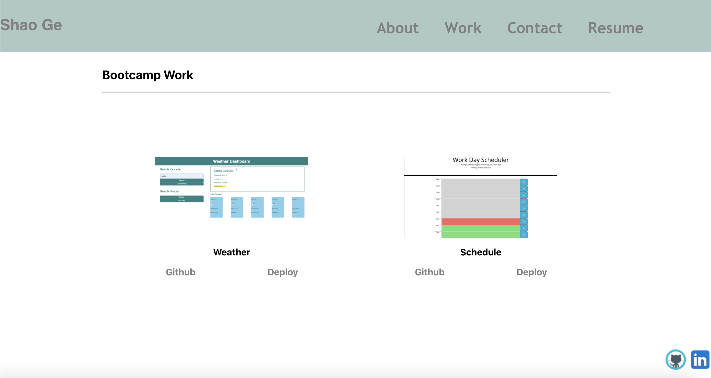

# React Portfolio
## Description
  Add functionality to our existing Budget Tracker application to allow for offline access and functionality. The user will be able to add expenses and deposits to their budget with or without a connection. When entering transactions offline, they should populate the total when brought back online.

  ## Table of Content
  * [Installation](#installation)
  * [Finished_Requirements](#finished_Requirements)
  * [Screenshots](#screenshots)
  * [Github](#github)

  ## Installation
  Clone the repository from GitHub. First install all required dependencies by `npm i`. Run `npm start` in client folder. 
  
  ## Finished_Requirements
 * Updated portfolio featuring 6 total projects

 * Use React

 * A `Header` component that appears on multiple pages

 * A single `Project` component that will be used multiple times on a single page 

 * Navigation with React Router, dynamic rendering, or another third part router

 * A `Footer` component that appears on multiple pages

 * Update GitHub profile with pinned repositories featuring those same projects

 * Deploy this site to GitHub Pages using the [Create React App docs for deployment.](https://create-react-app.dev/docs/deployment/#github-pages)

  ## Screenshots
  

  ## Github
  [Github Deploy](https://sg3606.github.io/react_portfolio/)